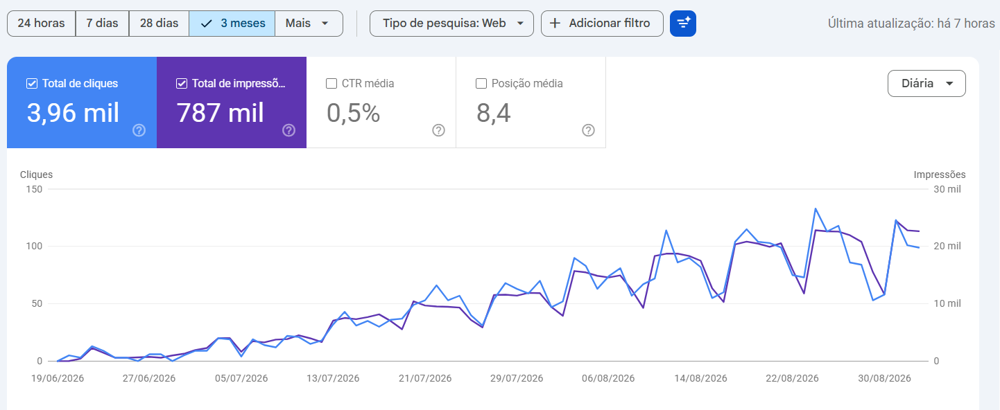
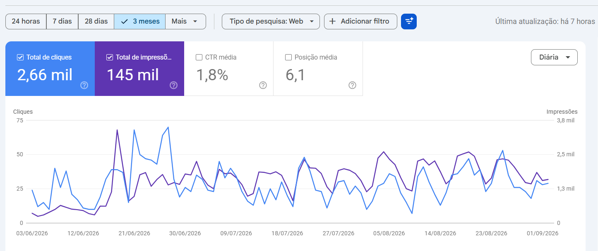
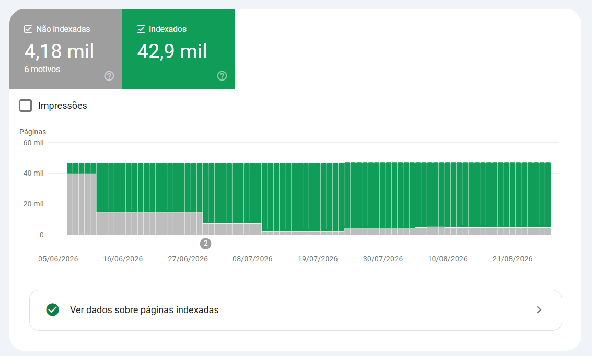

# Noa Brasil

**Software engineer.** I build B2B products end to end — database to deploy, product
design to the conversation with the customer. Five products in production, around 4,500
commits across 20 repositories.

Fortaleza, Brazil · remote · [brontobyte.com.br](https://brontobyte.com.br) · [LinkedIn](https://www.linkedin.com/in/noa-brasil/)

---

### Numbers I can point at

| What | Where | Result |
|---|---|---|
| Pages published in a free public catalogue | Oficina Vision | **17,304** |
| Pages indexed | Oficina Vision | **17,200** |
| Google Search, 3 months — impressions / clicks / position | Oficina Vision | **787,000 / 3,960 / 8.4** |
| Workshops testing the platform, across 5 states | Oficina Vision | **17** |
| Work orders handled in 6 months | Oficina Vision | **33,000+** |
| Pages indexed | Fox Elite Concursos | **42,900** |
| Google Search, 3 months — impressions / clicks / position | Fox Elite Concursos | **145,000 / 2,660 / 6.1** |
| Search over a 48,000-record question bank | Fox Elite Concursos | **745ms → 22ms** |
| AI processing cost across the whole content base | Fox Elite Concursos | **−85%**, same quality |
| AI-commented questions and mind maps delivered | Fox Elite Concursos | **48,093** and **9,710** |
| Voice message turned into a structured record | VisionFinance | **~2s**, no transcription |

---

### What I build

**[oficinavision.com.br](https://oficinavision.com.br)** — a free public catalogue of
technical defects and tools, across a wide range of vehicle brands and types. No login, no
paywall, and enriched every month. **17,304 pages published**, with builds validated at zero
broken links and zero orphan pages.

In its first three months on Google Search it did **787,000 impressions and 3,960 clicks, at
an average position of 8.4** — first page, on average, for a domain that did not exist in
June. It went from close to zero to roughly 20,000 impressions a day over that period.

**[app.oficinavision.com.br](https://app.oficinavision.com.br)** — the platform behind it:
multi-tenant SaaS for the automotive sector, with **17 workshops across 5 states** testing it
and 33,000+ work orders handled in six months. Work orders opened and filled by voice, with
real-time AI: the camera reads the licence plate and an assistant returns the vehicle's
technical data on the technician's screen. The same engine serves 14 business segments
through configuration, with no code fork. Installable PWA, with subscription, recurring
billing and refunds handled in-app.

**Fox Elite Concursos** — study platform for Brazilian public-service examinations, in
Spring Boot with Java 21 and React. I took the question-bank search from **745ms to 22ms**
with a trigram index built without locking the table in production, and cut around **85% of
the AI processing cost** for the whole content base by changing models after measuring
quality on both. **48,093** AI-commented questions and **9,710** mind maps delivered.

Its **42,900 indexed pages** did **145,000 impressions and 2,660 clicks** in three months, at
an **average position of 6.1** — the second property of mine sitting on page one of Google,
and the higher-intent of the two: 1.8% click-through, against 0.5% on the defect catalogue.

The number I would defend first is indexation: **42,900 pages accepted by Google**, with the
not-indexed count falling from around 40,000 in early June to 4,180 today. On a site that
size, getting Google to accept the pages at all is the hard problem. Ranking them comes
after.

**[finance.visionlink.com.br](https://finance.visionlink.com.br)** — VisionFinance:
financial management that lives inside WhatsApp. A voice message becomes a structured record
in about two seconds — the audio goes straight to the model with a required response schema,
skipping transcription entirely — and from there becomes a receipt, a declaration, a
scheduled appointment, an instalment charge with a public payment link, or an invoice.

**[visionlink.com.br](https://visionlink.com.br)** — an AI monitor for YouTube live
broadcasts. It watches the stream, measures FPS, bitrate and audio in real time, and warns
the moment the broadcast degrades. It runs on the same infrastructure as the WhatsApp Cloud
API gateway that serves every product above through a single phone number, with fail-closed
webhooks, consent recorded and full delivery logging.

---

### Public code

**[Korp_Teste_NoaBrasil](https://github.com/brontobytebrasil/Korp_Teste_NoaBrasil)** — an
invoice issuing system built as a technical challenge. Angular on the front end, two C#
microservices on .NET 10, each with its own PostgreSQL, running with a single
`docker compose up`.

The part worth reading: idempotency uses the key as the table's primary key, written
inside the same transaction as the stock deduction, so a repeated request returns the
stored response instead of running twice — the database is the arbiter, not the
application. Optimistic concurrency uses a version token, and infrastructure failure (503)
is kept separate from business refusal (409), so the user gets a different action for
each. The repository ships a technical document answering the specification point by
point, including a section on what I have not done before.

---

### How I work

Payment webhooks signed and idempotent, with prices always recalculated on the server.
Tenant isolation on every query. Privacy by design, under Brazilian data protection law.
Every new feature ships behind a kill switch, so nothing breaks for whoever is already
using it. Additive migrations, applied before the code that needs them.

---

### Stack

`C#` `.NET` `Java` `Spring Boot` `Node.js` `Express` `TypeScript` `React` `Angular`
`PostgreSQL` `Prisma` `JPA` `Docker` `AWS S3` `Cloudflare` `Google Gemini` `Azure OpenAI`
`WhatsApp Cloud API` `PWA`

---

### Where this came from

It started in 2000 with GDI, a study group that became M&N Tecnologias, then N&R Soluções
Tecnológicas, and since 2022 is **Brontobyte** — the company I run today, where I hold
both the engineering and the business.

Currently finishing a Bachelor's in Software Engineering (September 2026).

**brontobytebrasil@gmail.com**

---

<b>Português</b>

 

**Engenheiro de software.** Construo produtos B2B de ponta a ponta — do banco de dados ao
deploy, do desenho do produto à conversa com o cliente. Cinco produtos em produção, cerca de
4.500 commits em 20 repositórios.

Fortaleza, Ceará · atendo remoto

#### Números que eu consigo mostrar

| O quê | Onde | Resultado |
|---|---|---|
| Páginas publicadas num catálogo público e gratuito | Oficina Vision | **17.304** |
| Páginas indexadas | Oficina Vision | **17.200** |
| Google, 3 meses — impressões / cliques / posição | Oficina Vision | **787.000 / 3.960 / 8,4** |
| Oficinas testando a plataforma, em 5 estados | Oficina Vision | **17** |
| Ordens de serviço em 6 meses | Oficina Vision | **33.000+** |
| Páginas indexadas | Fox Elite Concursos | **42.900** |
| Google, 3 meses — impressões / cliques / posição | Fox Elite Concursos | **145.000 / 2.660 / 6,1** |
| Busca sobre um banco de 48.000 questões | Fox Elite Concursos | **745ms → 22ms** |
| Custo de processamento de IA de toda a base | Fox Elite Concursos | **−85%**, mesma qualidade |
| Questões comentadas por IA e mapas mentais | Fox Elite Concursos | **48.093** e **9.710** |
| Áudio virando registro estruturado | VisionFinance | **~2s**, sem transcrição |

#### O que eu construo

**[oficinavision.com.br](https://oficinavision.com.br)** — catálogo público e gratuito de
defeitos técnicos e ferramentas, cobrindo uma faixa larga de marcas e tipos de veículo. Sem
login, sem paywall, e enriquecido todo mês. **17.304 páginas publicadas**, com build validado
em zero link quebrado e zero página órfã.

Nos primeiros três meses no Google fez **787.000 impressões e 3.960 cliques, com posição média
8,4** — primeira página, na média, para um domínio que não existia em junho. Saiu de perto de
zero para cerca de 20.000 impressões por dia nesse período.

**[app.oficinavision.com.br](https://app.oficinavision.com.br)** — a plataforma por trás
dele: SaaS multi-tenant para o setor automotivo, com **17 oficinas em 5 estados** testando e
mais de 33.000 ordens de serviço em seis meses. Ordem de serviço aberta e preenchida por voz,
com IA em tempo real: a câmera lê a placa e um assistente devolve o dado técnico do veículo
na tela do técnico. O mesmo motor atende 14 segmentos por configuração, sem fork de código.
PWA instalável, com assinatura, cobrança recorrente e estorno resolvidos dentro do app.

**Fox Elite Concursos** — plataforma de estudo para concursos públicos, em Spring Boot com
Java 21 e React. Levei a busca do banco de questões de **745ms para 22ms** com índice trigram
criado sem travar a tabela em produção, e cortei cerca de **85% do custo de processamento de
IA** de toda a base trocando o modelo, depois de medir a qualidade nos dois. **48.093**
questões comentadas por IA e **9.710** mapas mentais entregues.

As **42.900 páginas indexadas** fizeram **145.000 impressões e 2.660 cliques** em três meses,
com **posição média 6,1** — a segunda propriedade minha na primeira página do Google, e a de
maior intenção das duas: 1,8% de clique, contra 0,5% no catálogo de defeitos.

O número que eu defendo primeiro é a indexação: **42.900 páginas aceitas pelo Google**, com o
total de não indexadas caindo de cerca de 40.000 no começo de junho para 4.180 hoje. Em site
desse tamanho, o problema difícil é o Google aceitar a página. Ranquear vem depois.

**[finance.visionlink.com.br](https://finance.visionlink.com.br)** — VisionFinance: gestão
financeira que vive dentro do WhatsApp. Um áudio vira registro estruturado em cerca de dois
segundos — o áudio vai direto ao modelo com esquema de resposta obrigatório, pulando a
transcrição — e dali vira recibo, declaração, agendamento, cobrança parcelada com link
público de pagamento, ou nota fiscal.

**[visionlink.com.br](https://visionlink.com.br)** — monitor com IA para transmissão ao vivo
no YouTube. Acompanha a transmissão, mede FPS, bitrate e áudio em tempo real, e avisa no
instante em que ela degrada. Roda sobre a mesma infraestrutura do gateway de WhatsApp Cloud
API que atende todos os produtos acima por um número só, com webhook fail-closed,
consentimento registrado e log completo de entrega.

#### Código público

**[Korp_Teste_NoaBrasil](https://github.com/brontobytebrasil/Korp_Teste_NoaBrasil)** —
sistema de emissão de notas fiscais feito como desafio técnico. Angular no front, dois
microsserviços em C# sobre .NET 10, cada um com seu PostgreSQL, subindo com um único
`docker compose up`.

O trecho que vale ler: a idempotência usa a chave como chave primária da tabela, gravada
na mesma transação da baixa de estoque, de modo que uma requisição repetida devolve a
resposta guardada em vez de rodar duas vezes — quem arbitra é o banco, não a aplicação.
Concorrência otimista com token de versão, e falha de infraestrutura (503) separada de
recusa de negócio (409), para o usuário receber uma ação diferente em cada caso. O
repositório traz um documento técnico respondendo a especificação ponto a ponto, incluindo
uma seção sobre o que eu ainda não fiz.

#### Como eu trabalho

Webhook de pagamento assinado e idempotente, com preço sempre recalculado no servidor.
Isolamento por cliente em toda consulta. Privacidade por desenho, dentro da LGPD. Toda
funcionalidade nova entra atrás de kill-switch, para nunca quebrar quem já está usando.
Migração aditiva, aplicada antes do código que depende dela.

#### De onde isso vem

Começou em 2000 com o GDI, um grupo de estudos que virou M&N Tecnologias, depois N&R
Soluções Tecnológicas, e desde 2022 é a **Brontobyte** — a empresa que eu toco hoje, onde
respondo pela engenharia e pelo negócio.

Terminando o Bacharelado em Engenharia de Software (setembro de 2026).

